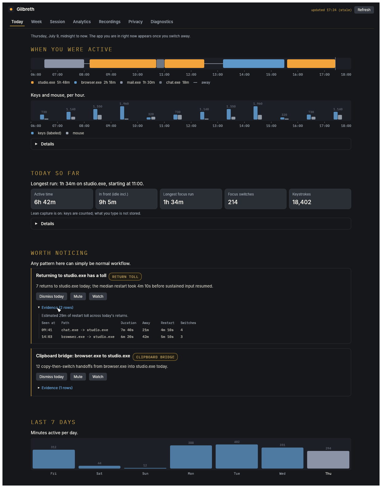
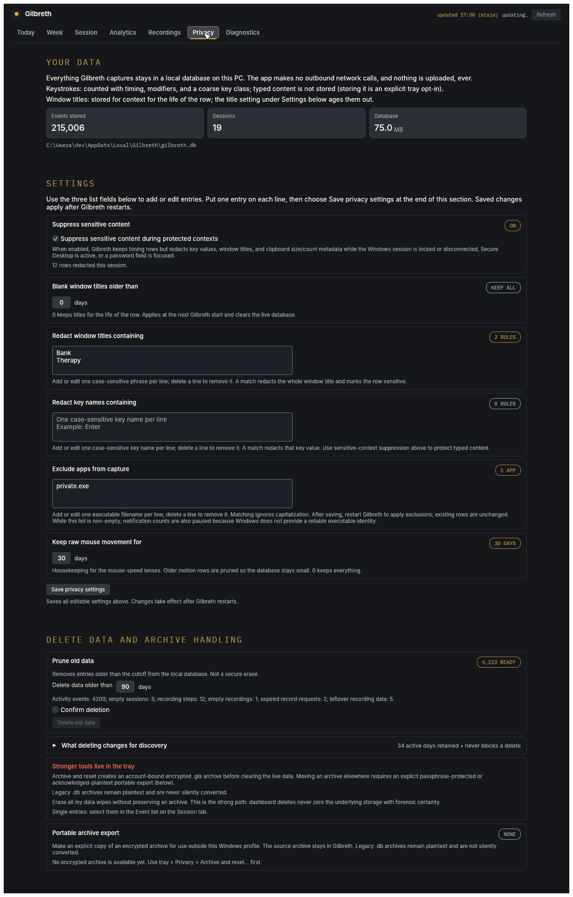

# Gilbreth

**A privacy-respecting "time & motion" study for your computer: capture how you work, record the routines you'd like to automate, and discover patterns you've never seen.**

**Download:**

[](https://github.com/Tyler-Systems/Gilbreth/releases/latest) 

**Badges:**

    

A century ago, Frank and Lillian Gilbreth filmed people at work, found the
wasted motions, and made the work less tiring. Gilbreth does that for computer
work: a small tray app records app switches, window changes, input timing and
motion, and idle time into a local SQLite database, and a native dashboard
shows you where your day actually went. Your data never leaves your machine:
no outbound network calls, no telemetry, no account.

## Download

**[Gilbreth v0.1.1 for Windows 11 (x64)](https://github.com/Tyler-Systems/Gilbreth/releases/latest)**
is the current release, an early preview. Each release is a signed installer
alongside `release-manifest.json` and `SHA256SUMS.txt`;
**[docs/VERIFY.md](docs/VERIFY.md)** shows how to check all three before you
run Setup. Windows SmartScreen may warn while the signing certificate is new.

Not on Windows? macOS capture works in development builds with no packaged
release yet, and developers on either platform can
[build from source](#getting-started-developers). The website is
**[gilbreth.tylersystems.com](https://gilbreth.tylersystems.com/)**.

<p align="center">
  <a href="crates/gilbreth-dashboard/tests/snapshots/windows/today_rich.png"></a>
  <a href="crates/gilbreth-dashboard/tests/snapshots/windows/privacy_rich.png"></a>
</p>

Before installing anything that records you, look at the Privacy tab (right):
what is stored, the redaction and exclusion rules, how long things are kept,
and how to delete them. Both images are the dashboard's own test snapshots,
rendered from fixture data rather than a real person's activity, and
regenerated whenever the interface changes.

## First run

Setup offers to launch Gilbreth when it finishes; it lives in the system
tray. Open the dashboard from the tray menu and the Today tab starts filling
within minutes: a timeline of what was in front, an hourly input pulse, and
the day's headline figures. The discovery surfaces (routine motifs,
interruption costs, the week digest) need a few days of normal use before
they say anything interesting.

From the first minute:

- Pause all ambient capture with Ctrl+Alt+Shift+P or the tray's Pause capture
  item; every stream also toggles off individually.
- Typed key content is not stored by default. Keystrokes are counted and
  classified, never recorded verbatim, unless you explicitly opt in.
- Everything lives under `%LOCALAPPDATA%\Gilbreth`. The dashboard's Privacy
  tab shows what is stored and lets you redact, prune, or erase it.
- Updates are manual because Gilbreth never checks the network. New versions
  are announced on the [website](https://gilbreth.tylersystems.com/) and the
  [releases page](https://github.com/Tyler-Systems/Gilbreth/releases).

All of those controls live in the tray menu:


## Follow along

Gilbreth is built in the open by one person. Set the repository's Watch to
releases-only for one notification per release, or join the
[release list](https://gilbreth.tylersystems.com/#waitlist) for the email
version. [Issues](https://github.com/Tyler-Systems/Gilbreth/issues) are open
to everyone, bug reports and proposals alike, and a star makes the project
easier for the next person to find.

## Project status

| Area | Current state | Next gate |
|---|---|---|
| Windows x64 | Supported. [`v0.1.1`](https://github.com/Tyler-Systems/Gilbreth/releases/tag/v0.1.1) is published, signed, and built from this source root. | None open. Later versions follow the [release process](docs/RELEASE_PROCESS.md). |
| macOS arm64 | Ambient capture and dogfood work; no packaged release. | The macOS distribution work, before any macOS package ships. |
| Linux | Portable-library and CI hygiene only. | No Linux product release is planned. |
| Contributions | Open. Issues need nothing; code needs a signed [contributor licence agreement](CONTRIBUTOR_AGREEMENT.md). | None open. |

Maintainers and contributors: start with the
[maintainer guide](docs/MAINTAINING.md). The canonical project
documents are the [release process](docs/RELEASE_PROCESS.md),
[architecture](docs/ARCHITECTURE.md), [verification guide](docs/VERIFY.md),
[platform capability matrix](docs/CAPABILITY_MATRIX.md), and
[security policy](SECURITY.md).

This repository begins with a single commit. Gilbreth was developed privately
from November 2024, and the initial public import followed a privacy and
intellectual-property review, so the earlier history stays in a private
archive. Two prototypes from that period informed v2: a Rust capture
implementation by **xozi**, and the original Python implementation.

---

## The name

<!-- copy-allow: negative-contrast the Gilbreths' recorded philosophy (humane over fast) is a historical fact statement, not rhetorical reframing (Lane B ruling) -->
The project is named for **Frank and Lillian Gilbreth**, the early-20th-century pioneers of *time and motion study*. They filmed and dissected the elemental motions of work to make tasks less tiring and more humane, not just faster. Lillian, a pioneer of industrial psychology, insisted that efficiency serve the *worker*, not the other way around. Gilbreth (the app) carries that idea into the digital workplace: **study the motions, remove the friction, keep the human at the center.**

---

## Mission & principles

**Gilbreth** helps people understand how they actually use a computer, so they can find repetitive, fragmented, or tiring workflows and decide what's worth improving or automating. It captures a motion-level record of your activity and keeps it entirely on your machine.

1. **Efficiency serves the worker** — remove the tiring motions instead of demanding more speed; the Gilbreths' rule, kept.
2. **Scientific rigor** — capture accurate, structured, complete data so the analysis is meaningful.
3. **Data sovereignty** — Gilbreth captures a lot (keystroke timing and motion, though not typed content by default), so the contract is strict: **your data never leaves your machine**, any capture stream can be disabled at runtime, and you can inspect, archive, age out, and delete everything it records. No outbound network calls, no telemetry: by architecture, not policy.
4. **Portable, not captive** — Gilbreth is a local **capture-and-discovery** layer, not an automation platform. It runs no automation and picks no winner: discovery produces **portable, value-free local artifacts** (the SQLite database and Record Routine JSON exports) that *you* can carry to an LLM agent, an RPA tool, or your own analysis, or nowhere at all.

> **On "AI":** the long-term goal is ML-driven automation suggestions, but v2 ships heuristic analytics first. We describe what's built, not what's aspirational.

**Where Gilbreth sits.** Plenty of tools capture local activity (ActivityWatch) or record everything (screenpipe, Rewind), and enterprise task mining (Power Automate, Mimica) finds automatable work inside organizations. For individuals, the missing piece is **friction discovery**: surfacing where your work is repetitive, fragmented, or tiring so you can decide what's worth removing. That layer is Gilbreth's focus; a 2026 competitive scan found no individual-focused product combining local capture, value-free discovery, and portable handoff.

Today's discovery is heuristic, and it already ships: the Today tab's **Worth noticing** cards, routine motifs, cross-app copy hand-offs (clipboard and modifier metadata only, never contents), fragmentation and focus metrics with an interruption-cost figure (what a pull-away costs on return), Input Exposure, a week digest that flags patterns appearing or going quiet, and **Working Spheres** (work episodes with app composition, plus an opt-in view that names episodes from window titles).

"Value-free" describes the analysis defaults and exports, which use no input content. Ambient capture covers app/window activity, input timing and motion, system state, and selected metadata streams, deliberately bounded: typed key content is off by default (keystrokes are counted and classified, not recorded verbatim), exclusions and sensitive-context rules limit persistence, background-process churn is summarized, and raw mouse-move history ages out by default. Window titles are stored unless redacted or aged out; the one analysis that reads their content (the opt-in Working Spheres named view) is off by default, runs at view time on your machine only, and its names never enter an export. Every other view treats a title as an opaque row field (see [Privacy & data](#-privacy--data)).

---

## Architecture at a glance

Gilbreth v2 is one Rust executable with two process roles: the long-running tray process captures, filters, and stores activity, while an on-demand `--dashboard` process renders the native egui dashboard. SQLite is the local contract between them; there is no dashboard server or socket.

```
┌───────────────────────────────────────────────┐                  ┌──────────────────────────┐
│       gilbreth-app  (capture/tray role)       │                  │ gilbreth-app --dashboard │
│                                               │                  │      (Rust / egui)       │
│ capture ──▶ privacy filter ──▶ SQLite write   │ ──▶ gilbreth.db  │ native views • analytics │
│ (Win32)     (framed door,      (batched,      │ ◀── WAL reads ── │  privacy/config actions  │
│ tray shell  open by default)   single-writer) │                  │ selected delete / prune  │
└───────────────────────────────────────────────┘                  └──────────────────────────┘
```

| Piece | Language | Responsibility | Status |
|---|---|---|---|
| **Capture** | Rust | Foreground/focus, keyboard, mouse, system, idle/active, power boundaries, presence/lock, clipboard metadata, and best-effort process launch/exit through Windows and macOS `EventSource` backends; window-lifecycle and notification rows are Windows-only. | M1/M5a + MAC-1 |
| **Privacy filter** | Rust | A pipeline stage between capture and storage: title/key redaction, sensitive-context suppression, `is_sensitive` flagging. Default policy: permissive except protected contexts. | M0 mechanism + M5a hardening |
| **Store** | Rust + SQLite | Single-writer, batched, WAL-mode local database — the source of truth and the contract. | M0 spine |
| **Reader** | Rust | `gilbreth-read`: WAL-safe analytics and export construction over the SQLite contract. | S2 parity port complete |
| **App shell** | Rust | Tray app: per-stream toggles, native dashboard launcher, launch-at-startup, privacy actions, and clean shutdown. Windows archive/reset and secure erase are shipped; remaining macOS exceptions are in the capability matrix. | M2/S6 + MAC-1 |
| **Dashboard** | Rust / egui | Seven native surfaces on Windows: Today, Week, Session, Analytics, Recordings, Privacy, and Diagnostics. macOS ships six — Recordings is absent because Record Routine is Windows-only; see the capability matrix. Runs as the same executable with `--dashboard`; no network listener. | S4 + S6 native-only |

**Why this shape:** capture ownership stays isolated from dashboard lifetime, while one self-contained Rust artifact supplies both roles. SQLite/WAL decouples the processes without adding IPC, a web server, or a shipped Python runtime. The retired Python oracle remains only in the private historical archive, not the fresh public root.

**Record Routine (M5b).** The always-on app captures lightweight motion signals to find patterns worth reviewing. When one is worth a closer look, Record Routine is the bounded, opt-in path: the dashboard requests a recording, the tray owns the two-confirmation start/stop/pause lifecycle, and a UI Automation worker emits **value-free semantic action rows** — stable element identity + action type, never input values, window titles, or UIA `Name`. Baseline capture is suspended during a recording and resumes with a title-redacted reseed after, so routine capture can't leak typed content an app echoes into its title. Recordings export locally as a value-free **Agent handoff trace**, or, once replay-readiness is verified, a selector-backed **Native automation blueprint**. Neither is a runnable script; Gilbreth never runs automation. The shipped/closed elevated-capture path is the disabled-by-default local `runas` helper lane, confirmed per recording. Signed UIAccess public distribution remains deferred. What an EDR/AV sees, and why the recorder cannot read text content: [threat model & EDR posture](docs/RECORD_ROUTINE_THREAT_MODEL.md).

**Where the boundary sits:** capture, discovery, and export all happen locally. Gilbreth hands you a portable, value-free artifact; whether you feed it to a cloud agent, a local RPA tool, or nothing at all is your choice, made outside Gilbreth.

---

<a id="-privacy--data"></a>

## Privacy & data

Gilbreth captures a broad, structured motion record, with deliberate privacy and noise bounds. **Typed key content is not stored by default** because the discovery layer never reads key values. What makes it acceptable:

- **Lean keystroke capture by default.** Key events are recorded for their timing, counts, modifier state, window context, and a coarse value-free key class (printable / navigation / modifier / function) — but the **key name itself is not stored**, so typed text can't be reconstructed from the keystroke stream. Keystroke *content* capture is an explicit opt-in under the tray **Privacy > Store typed key content** (for uses such as future ML input-value work); the change applies on the next run. The dashboard states the live posture on the Today and Privacy tabs. (Window *titles* are a separate channel: an app that echoes what you type into its title bar (a browser address bar, an editor's document line) can put that text in the stored title, which is why title redaction, the dashboard's title-hidden-by-default view, and an optional **title-retention window** (`privacy.title_retention_days`: blank titles on rows older than N days while keeping the row's timing/app data) exist. The one analysis that reads stored titles is the opt-in **Working Spheres named view**, which names work episodes at view time, locally; the names and your rename map (`spheres.json`) never enter exports or archives. Lean keystroke capture is about the key stream, not titles.)
- **Local only.** The live activity database, configuration, diagnostic logs, encrypted archives, sidecars, and content-free operation receipts live under `%LOCALAPPDATA%\Gilbreth`. Gilbreth makes no outbound network calls: no telemetry, cloud service, dashboard server, or automatic update checks. Updating is a manual act (new versions are announced on the site and GitHub). A portable archive export is also an explicit local action: it writes a passphrase-protected `.gla` file or, only after acknowledgement, a plaintext `.db` copy to Downloads; Gilbreth never uploads either. Tray **Erase all my data** wipes the database *and* the sphere-name sidecar, and offers to delete the diagnostic logs too (they never contain typed text or titles, but can mention app names).
- **You control capture.** Any stream toggles off at runtime from the tray and the choice persists in `config.toml`; a disabled stream's events are dropped before they are ever buffered or written. The tray **Pause capture** item pauses or resumes ambient capture on both platforms, as does the global **Ctrl+Alt+Shift+P** chord (Control-Option-Shift-P on macOS), which `[hotkey].pause_resume` can rebind or disable. The chord needs no permission on either platform. On macOS its behaviour during system secure input is not characterised; the tray item is unaffected.
- **Always visible, never stealth.** There is no hidden mode and never will be: the tray icon is always present while Gilbreth runs, all-capture pause has its own visible paused icon, and Record Routine shows a distinct recording/paused indicator by default. Gilbreth records whoever is using the Windows session it runs in — on a shared computer, that visibility is the consent mechanism; tell the people who share the machine.
- **A privacy filter sits before persistence.** Configured title/key redaction, per-app exclusions, and sensitive-context suppression default to permissive for normal activity (the "framed door, open by default" model). Redaction prefers **redact-keep-row** (blank the content, keep the timing) so motion data survives even when content doesn't; an excluded app's attributed rows never enter storage.
- **Sensitive contexts suppress content automatically.** Session lock/disconnect, Secure Desktop/UAC switches, and confirmed focused password fields redact key values, window titles, notification labels, and clipboard metadata until the context exits; the keyboard path fails closed while password state is uncertain.
- **Side streams are metadata-only.** Clipboard stores format family and size, never contents. Notifications store the source app and count only, never toast title, body, actions, XML, or other content; because Windows does not provide a reliable notification-label-to-executable mapping, configuring any per-app exclusion disables notification rows globally. Process rows store PID + executable path, never command lines or arguments. No screen pixels, no audio, ever.
- **Capture noise is bounded by default (demote, don't discard).** Windows churns background processes by design, and raw mouse movement dominates a long-run database, so two defaults keep it small and reviewable. (1) Process start/exit rows are kept **only for apps you have actually focused** (so crash evidence for your real apps survives), while background churn (service hosts, updaters, tool pipelines) is *counted, not stored*: an hourly summary row keeps the churn rate visible on the Diagnostics tab, and a sustained same-name restart pattern is flagged there, because a churn spike can itself be a health signal (crash loop, runaway updater). (2) Raw mouse-movement rows are kept for a bounded window (default 30 days; keys, clicks, and scrolls keep the full retention window), which bounds how far back mouse-speed metrics can see. Both are plain settings (`capture.process_filter`, `privacy.mouse_move_retention_days`, editable in the dashboard's Redaction rules) and both can be turned off.
- **You can inspect, age out, and delete.** The dashboard shows everything recorded, supports selected-row delete and manual pruning, and the app enforces `privacy.retention_days` at startup. The Windows package also ships **Archive and reset...** and **Erase all my data...** (secure erase). Secure erase removes this Windows user's Gilbreth activity data, discarding capture in flight. Each operation writes a content-free receipt using the exact outcomes **copied**, **removed**, **retained**, **deferred**, and **needs retry**. Plain row deletion is not forensic erase. New Windows tray archives are AES-256-GCM `.gla` files whose key is protected by the current Windows account; they are not recoverable if that Windows profile is lost. Make an explicit passphrase-protected portable export for anything that must outlive or leave the profile. Acknowledged plaintext exports and legacy `.db` archives remain full plaintext activity databases and must be protected accordingly; Diagnostics reports the legacy plaintext count without exposing filenames or paths. macOS archive/reset waits for the MAC-2 key-wrap decision and is not currently a usable dogfood action.
- **Known caveats, documented not hidden:** software-KVM input relaying is detected and tagged rather than misattributed; Modern Standby gaps are recovered with explicit audit rows; some dashboard numbers are bounded review aids. Details: [ARCHITECTURE.md](docs/ARCHITECTURE.md) §5–8.

**Deferred:** Browser URL/document capture stays deferred until there is a value-free design; per-app resource sampling is out of scope.

---

## Repository layout

```
Gilbreth/
├── crates/
│   ├── gilbreth-core/             # event schema, EventSource trait, privacy filter, pipeline
│   ├── gilbreth-capture-windows/  # Win32/WinRT capture implementations
│   ├── gilbreth-capture-macos/    # macOS ambient capture (MAC-1; public packaging is MAC-2)
│   ├── gilbreth-store/            # rusqlite + migrations (the single writer)
│   ├── gilbreth-read/             # native read-time analytics and replay export construction
│   ├── gilbreth-dashboard/        # native egui shell, charts, and seven product surfaces
│   └── gilbreth-app/              # the tray binary that wires it together
├── schema/                        # canonical SQL + migration docs
├── scripts/                       # install/update and verifier-host operational tooling/tests
└── docs/                          # architecture, capability matrix, release, verification, maintaining
```

---

## Roadmap

- **M0 — Walking skeleton** — the whole pipeline end-to-end with one event type.
- **M1 — Capture breadth** — windows, keyboard, mouse, system, idle/active.
- **M2 — App shell** — tray menu, typed config, dashboard launcher, single-instance, clean shutdown.
- **M3 — Dashboard & privacy controls** — row delete, retention prune, secure erase; now served by the native dashboard.
- **M4 — Heuristic analytics** — read-time rollups + conservative "Patterns Worth Reviewing" cards, plus post-M4 run-review, reliability, and standby hardening. The original milestone tags remain only in the private archive.
- **M5a — Capture completeness** — presence/lock boundaries, sensitive-context suppression, clipboard/notification/process metadata, click semantics. Landed; live-smoke validation for hardware-dependent paths remains.
- **M5b — Record Routine** — opt-in semantic action capture, dashboard review, replay-readiness verdicts, local value-free export (Agent handoff trace • Native automation blueprint), and the local `runas` elevated-capture lane are shipped/closed. Signed UIAccess public distribution and the listed future branches remain deferred.
- **M6 — ML & beyond** — ML-driven recommendations and later platform expansion, including the macOS distribution work that a public macOS package waits on.

**Completed:** **R0 "usable by a stranger" on 2026-07-04**, and **R1's first packaged Windows build on 2026-07-18**. Both happened in the private repository, and that package is not republished here. Discovery and macOS packaging come next. The friction-discovery triad already ships from captured data: **repetition** (routine motifs, cross-app copy hand-offs), **fragmentation** (focus metrics, resumption lag), and **fatigue** (Input Exposure).

---

## Getting started (developers)

```powershell
# Build & run the agent (Windows + Rust toolchain; bundled SQLite needs MSVC build tools)
cargo run -p gilbreth-app

# Stable console-less install + Start Menu/Desktop shortcuts (re-run after pulling)
.\scripts\install-windows.ps1                   # then launch the "Gilbreth" shortcut
.\scripts\install-windows.ps1 -LaunchAtStartup  # ...and autostart on logon

# Run the same native dashboard process the tray launches.
cargo run -p gilbreth-app -- --dashboard

# Verifier-host tooling (required when operational/release checks are routed;
# never a product/runtime dependency)
python -m pip install -r scripts/requirements-dev.txt
python -m pytest scripts/tests -q
python scripts/review_run.py
```

Verify either supported developer install with `.\scripts\verify_build_install.ps1`. The separate signed elevated-helper distribution lane remains deferred in the roadmap.

Releases follow the lightweight **[release process](docs/RELEASE_PROCESS.md)**.
Each one is pinned by its own annotated tag, release manifest, and checksums.

Windows packages target **Windows 11 x64**; the clean-machine evidence is
Windows 11 Enterprise Evaluation 25H2 (build 26200.8655), x64. Windows 10 and
Windows on ARM64 are untested. Updates are manual, because Gilbreth never checks
the network for a new version. Download the new package, verify it using
**[docs/VERIFY.md](docs/VERIFY.md)**, and run its installer over the existing
installation; program files are replaced while the data root is preserved.

---

## Project feedback and contributions

Bug reports and feature proposals are welcome through
[GitHub Issues](https://github.com/Tyler-Systems/Gilbreth/issues), and need
nothing more than an issue.

Code contributions are open too, and require a signed
[Contributor Licence Agreement](CONTRIBUTOR_AGREEMENT.md) so that Gilbreth can
stay available under both AGPL-3.0-or-later and a commercial licence. You keep
the copyright in what you write, and the agreement obliges the project to keep
licensing your contribution under an OSI-approved open licence as well. A bot
asks you to accept it on your first pull request; you accept once, not each
time. See [CONTRIBUTING.md](CONTRIBUTING.md).

Maintainer work has two tracks:

- **Rust product** — capture backends, event pipeline, SQLite storage/readers, tray shell, and native egui dashboard.
- **Operational tooling** — narrowly scoped Python/PowerShell verifier and release-evidence scripts under `scripts/`; Python is not shipped with the product.

Ground rules:
- **Keep the data-sovereignty contract intact:** no outbound network calls, no telemetry — data stays local and the native dashboard opens no listener.
- Keep analytics and export behavior in `gilbreth-read`; keep rendering and interaction in `gilbreth-dashboard`; keep platform/lifecycle ownership in `gilbreth-app`.
- Treat the retired Streamlit oracle as private-archive history, not a public-tree build or second shipping path.
- Match each surface's conventions (`cargo fmt` / `clippy` for Rust; scoped `black` / `ruff` for verifier-host Python).
- **Current local CI gate:** run `git config core.hooksPath .githooks` once to enable the [git hooks](.githooks/README.md) — fast pre-commit formatting/lint and a change-scoped pre-push gate. Hosted Windows, Linux, and macOS gates mirror the applicable checks.
- Read the **[maintainer guide](docs/MAINTAINING.md)** first; it maps current status, canonical documents, and common checks.

---

## PEOPLE

- **Tyler Arnold** ([@tylersystems](https://github.com/tylersystems)) — Anchorage, Alaska, USA • GMT-9
- **xozi** — **Rust capture prototype** (`main-rust`): Windows Raw Input capture, foreground/window tracking, system info; the reference implementation the v2 capture layer is salvaged from.
- **Past contributors & interns** — thank you to everyone who shaped Gilbreth through its many iterations.

---

## License

Copyright © 2024-2026 Tyler Systems LLC. Gilbreth's own source is licensed under the **GNU Affero General Public License, version 3 or (at your option) any later version** — see [LICENSE.md](LICENSE.md). SPDX: `AGPL-3.0-or-later`.

Bundled third-party components keep their own licenses and are not relicensed by the above. Gilbreth bundles two font families, Inter and IBM Plex Mono, both under the SIL Open Font License 1.1, whose terms require them to travel under that license in every copy; each ships with its license text beside it in `crates/gilbreth-dashboard/assets/fonts/`. Every other dependency is listed in [THIRD-PARTY-NOTICES.md](docs/THIRD-PARTY-NOTICES.md).

In plain terms: you may use, study, modify, and redistribute Gilbreth freely; if you distribute it (or offer a modified version over a network), your version must stay open under the same terms. For a tool that records keystrokes, that is the point: every fork stays publicly auditable. If the AGPL doesn't fit your situation, commercial licenses are available from Tyler Systems LLC.

---

**Gilbreth** — the careful study of work, one motion at a time.
